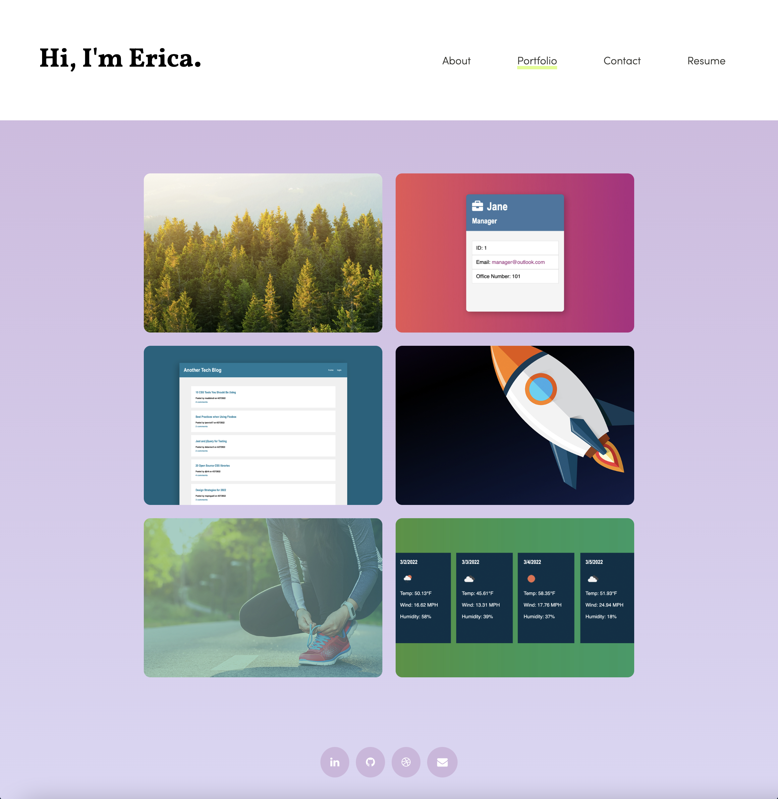

# React Portfolio

## Table of contents
* [Description](#description)
* [Installation](#installation)
* [Usage](#usage)
* [Technologies](#technologies)
* [Process](#process)
* [Results](#results)
* [Credit](#credit)

## Description
Create a single-page portfolio using React.

## Installation
Open the terminal and type the following to install all packages and dependencies:
```
npm install
```

## Usage
To run this application, type the following into the command line:

```
npm start
``` 
## Technologies
* HTML/CSS
* VS Code
* JavaScript
* Terminal
* Git/GitHub
* React

## Process
### STEP 1. - SETUP
* Create GitHub Repository with a unique name
* Push first commit of files into the new Repo using Git
* Install React
* Organize folder and file directory structure
* Build HTML and CSS template

### STEP 2. - BUILD COMPONENTS AND PAGES
* Create Component files for Footer, Header, Navigation, and Project
* Create Page files for About, Contact, Portfolio, and Resume
* Insert HTML template into appropriate components using JSX
* Implement CSS file into public index.html

### STEP 3. - ADD FUNCTIONALITY
* Add navigation/header functionality with useState Hook
* Add portfolio/project functionality with useState Hook
* Add contact form functionality with useState Hook

### STEP 4. - FINALIZE
* Worked through various bugs
* Made various commits throughout process to save progress
* Made tweaks and finished README.md

## Results
* [GitHub Link](https://etrenholm.github.io/response-umbrella/)
* [GitHub Repository](https://github.com/etrenholm/response-umbrella)

### Output Example



## Credit
Erica Trenholm: https://github.com/etrenholm

### ©️ June 2022